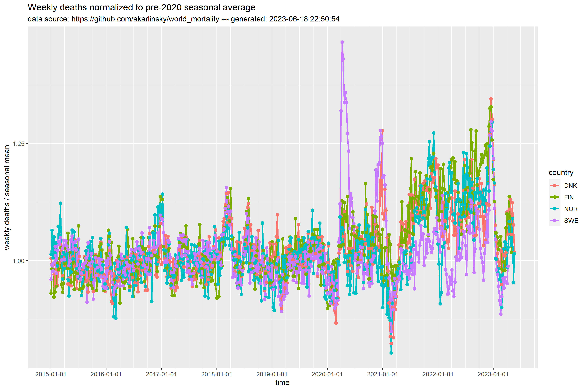
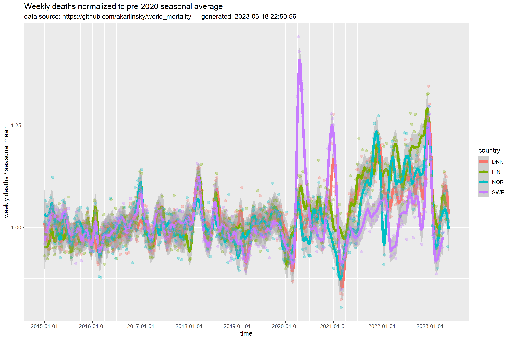
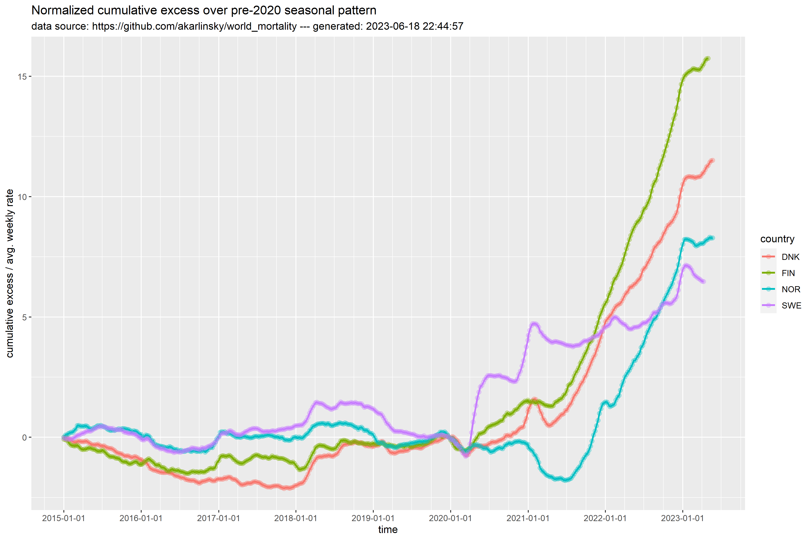

# mortr
Basic plotting of total mortality data

## Usage (stacked time series)
```
Rscript --vanilla wmd-plot.R SWE FIN DNK NOR ISL GBR USA
```

The above command requires `R` with `tidyverse` installed. It automatically downloads a data file from another `github` repository (https://github.com/akarlinsky/world_mortality) and generates PNG and PDF plots for the requested countries. To see the available countries and their three letter codes run
```
Rscript --vanilla wmd-plot.R list
```

## Usage (extended time series)
```
Rscript --vanilla wmd-plot.R series SWE FIN DNK NOR 
```

The above commands generates plots (see below) of raw mortality data along a (normal) time-axis. Another plot with rates normalized to pre-2020 averages will also be produced (not shown).

Raw counts:


Normalized to base rates:


Normalized to seasonal base rates:


Smoother version to guide the eye:


And finally a cumulative version (normalized to the weekly death rate):


The last plot was generated with
```
Rscript --vanilla wmd-plot.R cumulative SWE FIN DNK NOR 
```

## Usage (overall excess)
To generate a basic plot of normalized excess mortality for all countries do
```
Rscript --vanilla wmd-plot.R excess
```

Present version of basic excess plot:
 
